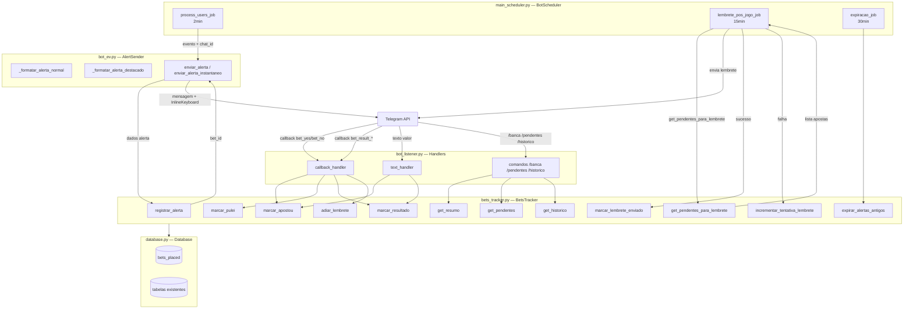
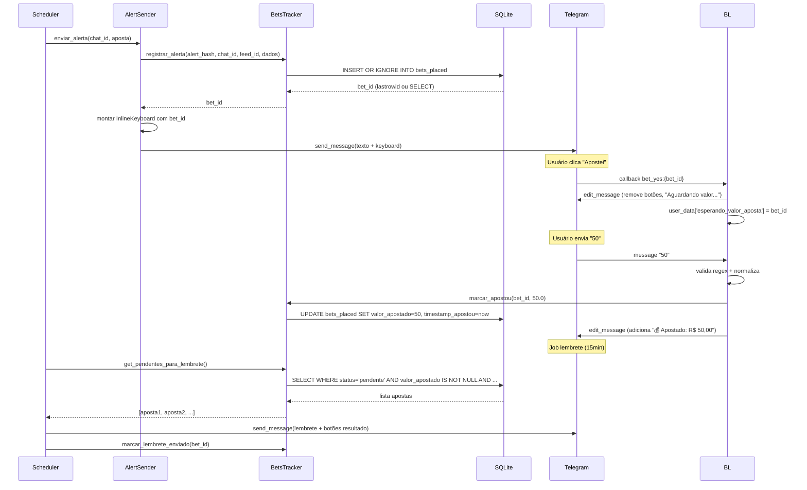
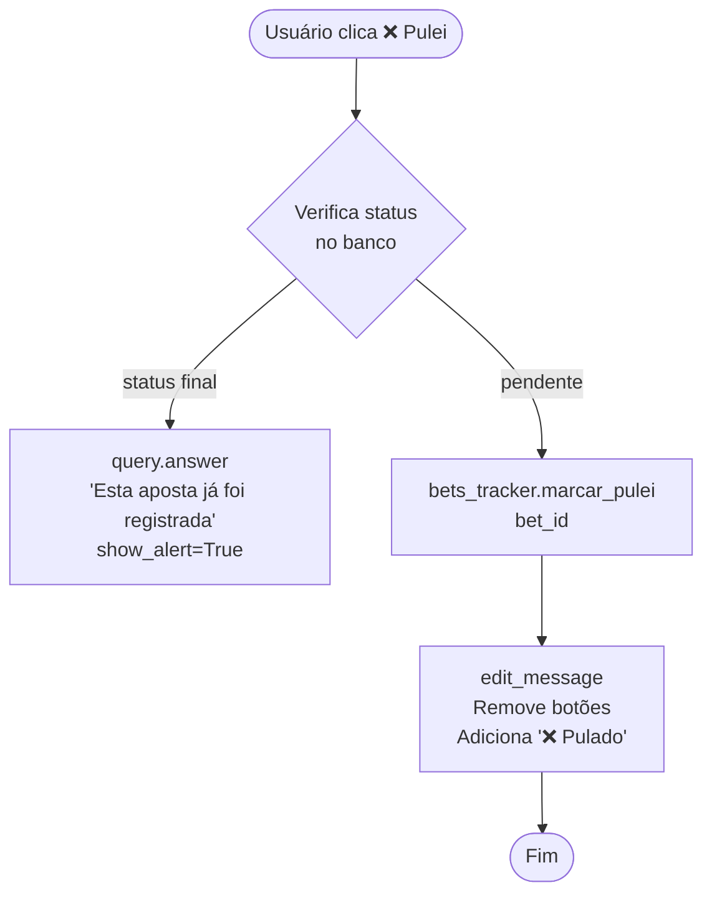
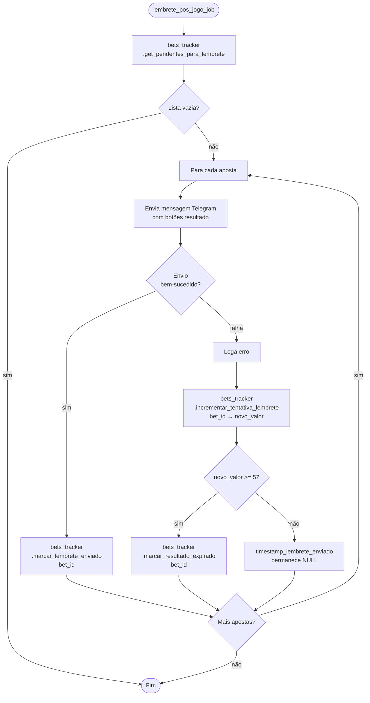
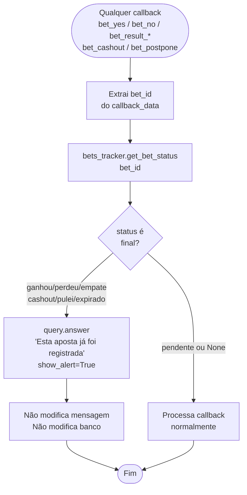

# Design Document — Bet Tracking System

## Overview

O Bet Tracking System adiciona rastreamento de apostas pessoais ao Bot EV+ existente. Cada alerta enviado via Telegram ganha botões de ação inline; o usuário registra se apostou, informa o valor, e depois do jogo registra o resultado. Todos os dados são persistidos em SQLite para geração de relatórios de ROI.

O sistema é composto por cinco camadas que se integram ao código existente sem quebrar nenhum comportamento atual:

1. **Migração do banco** — nova tabela `bets_placed` adicionada ao `_init_db()` existente
2. **`bets_tracker.py`** — módulo de lógica pura sem dependência do Telegram
3. **`bot_ev.py`** — modificado para registrar alertas e adicionar botões inline
4. **`bot_listener.py`** — novos handlers de callbacks e comandos
5. **`main_scheduler.py`** — dois novos jobs periódicos

---

## Architecture

### Diagrama de Componentes



### Fluxo de Dados: Alerta → Registro → Resultado



---

## Flow Diagrams

### Fluxo "Apostei"

```mermaid
flowchart TD
    A([Usuário clica ✅ Apostei]) --> B{Verifica status\nno banco}
    B -->|status final| C[query.answer\n'Esta aposta já foi registrada'\nshow_alert=True]
    B -->|pendente| D[edit_message\nRemove botões\nAdiciona '⏳ Aguardando valor...']
    D --> E[user_data\['esperando_valor_aposta'\] = bet_id]
    E --> F([Aguarda mensagem de texto])
    F --> G{Valida regex\n^\d+\([.,]\d{1,2}\)?$}
    G -->|inválido ou ≤ 0| H[Responde com erro\nMantém estado de espera]
    H --> F
    G -->|válido| I[Normaliza vírgula → ponto\nConverte para float]
    I --> J[bets_tracker.marcar_apostou\nbet_id, valor]
    J --> K[Limpa user_data\['esperando_valor_aposta'\]]
    K --> L[edit_message\nAdiciona '💰 Apostado: R$ X,XX']
    L --> M([Fim])
```

### Fluxo "Pulei"



### Fluxo Lembrete Pós-Jogo (Job 15min)



### Fluxo Cashout

```mermaid
flowchart TD
    A([Usuário clica 💸 Cashout]) --> B{Verifica status\nno banco}
    B -->|status final| C[query.answer\n'Esta aposta já foi registrada'\nshow_alert=True]
    B -->|pendente| D[edit_message\nRemove botões\nAdiciona '⏳ Aguardando valor do cashout...']
    D --> E[user_data\['esperando_valor_cashout'\] = bet_id]
    E --> F([Aguarda mensagem de texto])
    F --> G{Valida regex\n^\d+\([.,]\d{1,2}\)?$}
    G -->|inválido ou ≤ 0| H[Responde com erro\nMantém estado de espera]
    H --> F
    G -->|válido| I[Normaliza vírgula → ponto\nConverte para float]
    I --> J[bets_tracker.marcar_resultado\nbet_id, 'cashout', valor_cashout=valor]
    J --> K[Limpa user_data\['esperando_valor_cashout'\]]
    K --> L[edit_message\nAdiciona '💸 Cashout: R$ X,XX']
    L --> M([Fim])
```

### Fluxo Idempotência (qualquer callback em status final)



### Plano de Migração do Banco

A tabela `bets_placed` é adicionada ao método `_init_db()` existente em `database.py`, seguindo o padrão já estabelecido de `CREATE TABLE IF NOT EXISTS` + `ALTER TABLE ... ADD COLUMN` com try/except para colunas novas em bancos existentes.

**Posição no `_init_db()`**: após a tabela `api_cache` (item 12 atual), como item 13.

```python
# Em Database._init_db(), após a tabela api_cache:

# 13. Tabela bets_placed (bet tracking system)
conn.execute("""
    CREATE TABLE IF NOT EXISTS bets_placed (
        id                        INTEGER PRIMARY KEY AUTOINCREMENT,
        alert_hash                TEXT    NOT NULL UNIQUE,
        chat_id                   TEXT    NOT NULL,
        feed_id                   TEXT    NOT NULL,
        home                      TEXT,
        away                      TEXT,
        league                    TEXT,
        sport                     TEXT,
        market_type               TEXT,
        bet_side                  TEXT,
        bookmaker                 TEXT,
        odd_alerta                REAL,
        ev_alerta                 REAL,
        commence_time             TEXT,
        commence_time_ajustado    TEXT    DEFAULT NULL,
        valor_apostado            REAL    DEFAULT NULL,
        status                    TEXT    DEFAULT 'pendente'
                                          CHECK(status IN (
                                              'pendente','ganhou','perdeu',
                                              'empate','cashout','pulei','expirado'
                                          )),
        valor_cashout             REAL    DEFAULT NULL,
        lucro                     REAL    DEFAULT NULL,
        tentativas_lembrete       INTEGER DEFAULT 0,
        timestamp_alerta          TEXT,
        timestamp_apostou         TEXT,
        timestamp_resultado       TEXT,
        timestamp_lembrete_enviado TEXT
    )
""")

# Migrations incrementais para bancos existentes (padrão já usado no projeto)
try:
    conn.execute("ALTER TABLE bets_placed ADD COLUMN commence_time_ajustado TEXT DEFAULT NULL")
except Exception:
    pass  # Coluna já existe

try:
    conn.execute("ALTER TABLE bets_placed ADD COLUMN tentativas_lembrete INTEGER DEFAULT 0")
except Exception:
    pass  # Coluna já existe

# Índices
conn.execute("""
    CREATE INDEX IF NOT EXISTS idx_bets_chat
    ON bets_placed(chat_id)
""")
conn.execute("""
    CREATE INDEX IF NOT EXISTS idx_bets_status
    ON bets_placed(status)
""")
conn.execute("""
    CREATE INDEX IF NOT EXISTS idx_bets_pending_reminder
    ON bets_placed(status, commence_time, timestamp_lembrete_enviado)
""")
```

**Compatibilidade**: bancos existentes com dados nas tabelas `users`, `alert_cache`, `alert_history` etc. não são afetados. `CREATE TABLE IF NOT EXISTS` é idempotente. As colunas `commence_time_ajustado` e `tentativas_lembrete` já estão no `CREATE TABLE`, mas os `ALTER TABLE` com try/except garantem que bancos criados antes desta migration também recebam as colunas sem erro.

---

## Components and Interfaces

### 1. bets_tracker.py — Classe BetsTracker

Módulo de lógica pura. Não importa nada do Telegram. Recebe uma instância de `Database` no construtor.

```python
import hashlib
from datetime import datetime, timezone
from typing import TypedDict

# --- Constantes ---

DURACAO_ESPORTE: dict[str, float] = {
    "soccer":           2.5,
    "basketball":       2.5,
    "tennis":           3.0,
    "americanfootball": 3.5,
    "baseball":         3.5,
    "hockey":           2.5,
    "mma":              2.0,
    "boxing":           2.0,
    "esports":          2.0,
}
DURACAO_DEFAULT: float = 3.0

STATUSES_FINAIS: frozenset[str] = frozenset({
    "ganhou", "perdeu", "empate", "cashout", "pulei", "expirado"
})

TIMESTAMP_FORMAT = "%Y-%m-%d %H:%M:%S"

def now_utc_str() -> str:
    """Retorna timestamp UTC atual no formato padrão do banco."""
    return datetime.now(timezone.utc).strftime(TIMESTAMP_FORMAT)


# --- Exceção de defesa em profundidade ---

class StatusFinalError(Exception):
    """
    Levantada quando uma operação de mutação é tentada em uma aposta
    que já possui status final. Serve como defesa em profundidade
    contra bugs futuros nos handlers.
    """


# --- TypedDict para dados do alerta ---

class DadosAlerta(TypedDict):
    home:         str
    away:         str
    league:       str
    sport:        str
    market_type:  str
    bet_side:     str
    bookmaker:    str
    odd_alerta:   float   # campo bet365_odds do evento
    ev_alerta:    float   # campo ev do evento
    commence_time: str    # ISO 8601 UTC


# --- Funções utilitárias ---

def calcular_lucro(
    odd: float,
    valor_apostado: float,
    status: str,
    valor_cashout: float | None = None,
) -> float:
    """
    Calcula lucro líquido conforme o resultado.
    - ganhou:  (odd - 1) * valor_apostado
    - perdeu:  -valor_apostado
    - empate:  0.0
    - cashout: valor_cashout - valor_apostado
    Levanta ValueError para status inválido ou cashout sem valor.
    """

def gerar_alert_hash(
    chat_id: str,
    home: str,
    away: str,
    market_type: str,
    bet_side: str,
    bookmaker: str,
    commence_time: str,
) -> str:
    """SHA-256 truncado em 32 chars dos campos canônicos do alerta."""
    raw = f"{chat_id}|{home}|{away}|{market_type}|{bet_side}|{bookmaker}|{commence_time}"
    return hashlib.sha256(raw.encode()).hexdigest()[:32]


# --- Classe principal ---

class BetsTracker:
    def __init__(self, db: Database):
        """Recebe instância de Database. Não chama get_db() internamente."""

    # --- Registro ---
    def registrar_alerta(
        self,
        alert_hash: str,
        chat_id: str,
        feed_id: str,
        dados_alerta: DadosAlerta,
    ) -> int:
        """
        INSERT OR IGNORE em bets_placed.
        Retorna bet_id (id) do registro inserido ou já existente.
        Usa now_utc_str() para timestamp_alerta.
        """

    # --- Atualização de status ---
    def marcar_apostou(self, bet_id: int, valor: float) -> None:
        """
        UPDATE bets_placed SET valor_apostado=valor,
        timestamp_apostou=now_utc_str() WHERE id=bet_id.
        Não altera status (permanece 'pendente').
        Levanta StatusFinalError se a aposta já tem status final.
        """

    def marcar_pulei(self, bet_id: int) -> None:
        """
        UPDATE bets_placed SET status='pulei' WHERE id=bet_id.
        Levanta StatusFinalError se a aposta já tem status final.
        """

    def marcar_resultado(
        self,
        bet_id: int,
        resultado: str,
        valor_cashout: float | None = None,
    ) -> None:
        """
        Atualiza status, calcula lucro via calcular_lucro() e registra
        timestamp_resultado=now_utc_str(). resultado in {'ganhou','perdeu','empate','cashout'}.
        Para 'cashout', valor_cashout é obrigatório.
        Levanta StatusFinalError se a aposta já tem status final.
        """

    def marcar_resultado_expirado(self, bet_id: int) -> None:
        """
        UPDATE bets_placed SET status='expirado' WHERE id=bet_id.
        Usado pelo scheduler após 5 tentativas de lembrete falhas.
        Não levanta StatusFinalError — expiração forçada pelo sistema é sempre permitida.
        """

    # --- Lembretes ---
    def get_pendentes_para_lembrete(self) -> list[dict]:
        """
        SELECT WHERE status='pendente'
          AND valor_apostado IS NOT NULL
          AND COALESCE(commence_time_ajustado, commence_time) + DURACAO < now UTC
          AND timestamp_lembrete_enviado IS NULL
        Retorna lista de dicts com todos os campos da linha.
        """

    def marcar_lembrete_enviado(self, bet_id: int) -> None:
        """
        UPDATE SET timestamp_lembrete_enviado=now_utc_str(), tentativas_lembrete=0
        WHERE id=bet_id.
        """

    def adiar_lembrete(self, bet_id: int) -> None:
        """
        UPDATE SET
          commence_time_ajustado = COALESCE(commence_time_ajustado, commence_time) + 3h
                                   (formatado com now_utc_str() equivalente),
          timestamp_lembrete_enviado = NULL
        WHERE id=bet_id.
        commence_time original permanece inalterado.
        Levanta StatusFinalError se a aposta já tem status final.
        """

    def incrementar_tentativa_lembrete(self, bet_id: int) -> int:
        """
        UPDATE SET tentativas_lembrete = tentativas_lembrete + 1 WHERE id=bet_id.
        Retorna o novo valor de tentativas_lembrete.
        """

    # --- Expiração ---
    def expirar_alertas_antigos(self) -> int:
        """
        UPDATE SET status='expirado'
        WHERE status='pendente'
          AND valor_apostado IS NULL
          AND commence_time + 2h < now UTC.
        Retorna número de linhas afetadas.
        """

    # --- Consultas ---
    def get_resumo(self, chat_id: str, dias: int = 30) -> dict:
        """
        Retorna dict com:
          total_apostas, total_apostado, lucro_total, roi_pct,
          ganhou, perdeu, empate, cashout, ev_medio.
        Considera apenas status in ('ganhou','perdeu','empate','cashout')
        dos últimos `dias` dias (por timestamp_resultado).
        """

    def get_pendentes(self, chat_id: str) -> list[dict]:
        """
        SELECT WHERE status='pendente' AND valor_apostado IS NOT NULL
          AND chat_id=chat_id
        ORDER BY COALESCE(commence_time_ajustado, commence_time) ASC.
        """

    def get_historico(self, chat_id: str, limit: int = 20) -> list[dict]:
        """
        SELECT WHERE status IN ('ganhou','perdeu','empate','cashout')
          AND chat_id=chat_id
        ORDER BY timestamp_resultado DESC LIMIT limit.
        """

    def get_bet_status(self, bet_id: int) -> str | None:
        """
        Retorna o status atual de uma aposta ou None se não encontrada.
        Usado pelos handlers para verificar idempotência (Req 15).
        """
```

### 2. Modificações em bot_ev.py — AlertSender

```python
# Importações adicionais no topo do arquivo
from telegram import InlineKeyboardButton, InlineKeyboardMarkup
from config import THRESHOLD_EV_ALTO
# bets_tracker importado localmente para evitar circular import

class AlertSender:
    # Métodos existentes mantidos; novos métodos abaixo:

    async def _formatar_alerta_normal(self, aposta: dict) -> str:
        """
        Template padrão para ev < THRESHOLD_EV_ALTO.
        Inicia com: '🟢 <b>Alerta EV+</b>'
        Corpo idêntico ao _formatar_alerta() atual.
        """

    async def _formatar_alerta_destacado(self, aposta: dict, stake: float | None = None) -> str:
        """
        Template destacado para ev >= THRESHOLD_EV_ALTO.
        Inicia com: '🚨🚨 <b>ALERTA EV ALTO</b> 🚨🚨'
        Adiciona ⭐ ao lado do EV e linha '⚡ Aposte rápido'.
        """

    def _montar_keyboard(self, bet_id: int) -> InlineKeyboardMarkup:
        """
        Retorna InlineKeyboardMarkup com dois botões em linha:
          [✅ Apostei | callback_data=f"bet_yes:{bet_id}"]
          [❌ Pulei   | callback_data=f"bet_no:{bet_id}"]
        """

    async def enviar_alerta(self, chat_id, aposta: dict) -> None:
        """
        Fluxo atualizado:
        1. Importa BetsTracker e get_db localmente
        2. Gera alert_hash a partir dos dados do evento
        3. Chama bets_tracker.registrar_alerta() → bet_id
        4. Escolhe template: normal ou destacado (por THRESHOLD_EV_ALTO)
        5. Monta keyboard com bet_id
        6. Envia com parse_mode='HTML', disable_web_page_preview=True
        """

    async def enviar_alerta_instantaneo(self, chat_id, evento: dict, stake: float) -> None:
        """
        Mesmo fluxo de enviar_alerta, mas usa _formatar_alerta_destacado
        independente do EV (já filtrado pelo scheduler como >= 10%).
        """
```

**Geração do `alert_hash`** — função utilitária em `bets_tracker.py` (já incluída na seção de interfaces acima).

### 3. Novos Handlers em bot_listener.py

```python
# Importações adicionais
from bets_tracker import BetsTracker, STATUSES_FINAIS
bets_tracker = BetsTracker(db)   # db já é instância global existente

# Padrões de callback_data registrados
CALLBACK_PATTERNS = {
    "bet_yes":         r"^bet_yes:\d+$",
    "bet_no":          r"^bet_no:\d+$",
    "bet_result_win":  r"^bet_result_win:\d+$",
    "bet_result_loss": r"^bet_result_loss:\d+$",
    "bet_result_push": r"^bet_result_push:\d+$",
    "bet_cashout":     r"^bet_cashout:\d+$",
    "bet_postpone":    r"^bet_postpone:\d+$",
}

# Handlers de callback
async def bet_yes_callback(update: Update, context: ContextTypes.DEFAULT_TYPE) -> None: ...
async def bet_no_callback(update: Update, context: ContextTypes.DEFAULT_TYPE) -> None: ...
async def bet_result_win_callback(update: Update, context: ContextTypes.DEFAULT_TYPE) -> None: ...
async def bet_result_loss_callback(update: Update, context: ContextTypes.DEFAULT_TYPE) -> None: ...
async def bet_result_push_callback(update: Update, context: ContextTypes.DEFAULT_TYPE) -> None: ...
async def bet_cashout_callback(update: Update, context: ContextTypes.DEFAULT_TYPE) -> None: ...
async def bet_postpone_callback(update: Update, context: ContextTypes.DEFAULT_TYPE) -> None: ...

# Handler de texto (intercepta antes do handler genérico)
async def text_handler(update: Update, context: ContextTypes.DEFAULT_TYPE) -> None:
    """
    Verifica context.user_data:
    - 'esperando_valor_aposta'  → fluxo Apostei
    - 'esperando_valor_cashout' → fluxo Cashout
    - nenhum → passa para handler de mensagem existente (ou ignora)
    """

# Comandos de consulta
async def banca_command(update: Update, context: ContextTypes.DEFAULT_TYPE) -> None:
    """Aceita /banca ou /banca {dias}. Padrão: 30 dias."""

async def pendentes_command(update: Update, context: ContextTypes.DEFAULT_TYPE) -> None:
    """Lista apostas pendentes de resultado."""

async def historico_command(update: Update, context: ContextTypes.DEFAULT_TYPE) -> None:
    """Últimas 20 apostas finalizadas."""

# Registro no ApplicationBuilder (adicionar ao bloco de setup existente)
# app.add_handler(CallbackQueryHandler(bet_yes_callback,        pattern=r"^bet_yes:\d+$"))
# app.add_handler(CallbackQueryHandler(bet_no_callback,         pattern=r"^bet_no:\d+$"))
# app.add_handler(CallbackQueryHandler(bet_result_win_callback, pattern=r"^bet_result_win:\d+$"))
# app.add_handler(CallbackQueryHandler(bet_result_loss_callback,pattern=r"^bet_result_loss:\d+$"))
# app.add_handler(CallbackQueryHandler(bet_result_push_callback,pattern=r"^bet_result_push:\d+$"))
# app.add_handler(CallbackQueryHandler(bet_cashout_callback,    pattern=r"^bet_cashout:\d+$"))
# app.add_handler(CallbackQueryHandler(bet_postpone_callback,   pattern=r"^bet_postpone:\d+$"))
# app.add_handler(CommandHandler("banca",     banca_command))
# app.add_handler(CommandHandler("pendentes", pendentes_command))
# app.add_handler(CommandHandler("historico", historico_command))
# app.add_handler(MessageHandler(filters.TEXT & ~filters.COMMAND, text_handler))
```

### 4. Novos Jobs em main_scheduler.py

```python
# Em BotScheduler.__init__: adicionar referência ao bets_tracker
from bets_tracker import BetsTracker
self.bets_tracker = BetsTracker(self.db)

# Em BotScheduler.start(): adicionar após os jobs existentes
self.scheduler.add_job(
    self.lembrete_pos_jogo_job,
    IntervalTrigger(minutes=15),
    id='lembrete_pos_jogo',
    max_instances=1,
    replace_existing=True,
)
self.scheduler.add_job(
    self.expiracao_job,
    IntervalTrigger(minutes=30),
    id='expiracao_bets',
    max_instances=1,
    replace_existing=True,
)
```

### Mensagens de Confirmação de Resultado

Após cada resultado registrado, o handler edita a mensagem de lembrete removendo todos os botões inline e adicionando uma linha de confirmação ao final:

| Resultado | Linha adicionada |
|---|---|
| Ganhei | `🟢 Ganhou (+R$ X,XX)` |
| Perdi | `🔴 Perdeu (-R$ X,XX)` |
| Empate | `⚪ Empate (R$ 0,00)` |
| Cashout | `💸 Cashout: R$ X,XX (lucro: ±R$ X,XX)` |

O valor exibido é o `lucro` calculado por `calcular_lucro()` e persistido no banco. A mensagem original de lembrete é preservada; apenas os botões são removidos e a linha de confirmação é acrescentada ao final.

---

### Tabela `bets_placed`

```sql
CREATE TABLE IF NOT EXISTS bets_placed (
    id                        INTEGER PRIMARY KEY AUTOINCREMENT,
    alert_hash                TEXT    NOT NULL UNIQUE,
    chat_id                   TEXT    NOT NULL,
    feed_id                   TEXT    NOT NULL,
    home                      TEXT,
    away                      TEXT,
    league                    TEXT,
    sport                     TEXT,
    market_type               TEXT,
    bet_side                  TEXT,
    bookmaker                 TEXT,
    odd_alerta                REAL,
    ev_alerta                 REAL,
    commence_time             TEXT,                    -- ISO 8601 UTC, nunca modificado
    commence_time_ajustado    TEXT    DEFAULT NULL,    -- preenchido por adiar_lembrete()
    valor_apostado            REAL    DEFAULT NULL,
    status                    TEXT    DEFAULT 'pendente'
                                      CHECK(status IN (
                                          'pendente','ganhou','perdeu',
                                          'empate','cashout','pulei','expirado'
                                      )),
    valor_cashout             REAL    DEFAULT NULL,
    lucro                     REAL    DEFAULT NULL,
    tentativas_lembrete       INTEGER DEFAULT 0,
    timestamp_alerta          TEXT,
    timestamp_apostou         TEXT,
    timestamp_resultado       TEXT,
    timestamp_lembrete_enviado TEXT
);

CREATE INDEX IF NOT EXISTS idx_bets_chat
    ON bets_placed(chat_id);

CREATE INDEX IF NOT EXISTS idx_bets_status
    ON bets_placed(status);

CREATE INDEX IF NOT EXISTS idx_bets_pending_reminder
    ON bets_placed(status, commence_time, timestamp_lembrete_enviado);
```

### Constante `STATUSES_FINAIS` (em bets_tracker.py)

```python
STATUSES_FINAIS: frozenset[str] = frozenset({
    "ganhou", "perdeu", "empate", "cashout", "pulei", "expirado"
})
```

### Estrutura de retorno de `get_resumo()`

```python
{
    "total_apostas":  int,    # contagem de status finalizados (excl. pulei/expirado)
    "total_apostado": float,  # soma de valor_apostado
    "lucro_total":    float,  # soma de lucro
    "roi_pct":        float,  # (lucro_total / total_apostado) * 100 ou 0.0
    "ganhou":         int,
    "perdeu":         int,
    "empate":         int,
    "cashout":        int,
    "ev_medio":       float,  # média de ev_alerta dos registros finalizados
}
```

---

## Scheduler Jobs — Pseudocódigo Detalhado

### lembrete_pos_jogo_job (15min)

```python
async def lembrete_pos_jogo_job(self):
    """Job de lembrete pós-jogo — executa a cada 15 minutos."""
    try:
        pendentes = self.bets_tracker.get_pendentes_para_lembrete()
        if not pendentes:
            return

        for aposta in pendentes:
            chat_id = aposta['chat_id']   # lido diretamente da aposta retornada pelo tracker
            bet_id  = aposta['id']
            try:
                texto    = _formatar_lembrete(aposta)
                keyboard = _montar_keyboard_resultado(bet_id)

                await bot.send_message(
                    chat_id=int(chat_id),
                    text=texto,
                    parse_mode='HTML',
                    reply_markup=keyboard,
                    disable_web_page_preview=True,
                )
                # Sucesso: registra envio e zera tentativas
                self.bets_tracker.marcar_lembrete_enviado(bet_id)

            except Exception as e:
                logger_geral.error(
                    f"Falha lembrete bet_id={bet_id} chat_id={chat_id}: {e}"
                )
                novo = self.bets_tracker.incrementar_tentativa_lembrete(bet_id)
                if novo >= 5:
                    self.bets_tracker.marcar_resultado_expirado(bet_id)
                    logger_geral.warning(
                        f"Aposta bet_id={bet_id} expirada após {novo} tentativas"
                    )
                # timestamp_lembrete_enviado permanece NULL — aposta reaparece no próximo ciclo
                continue  # Não interrompe o loop para as demais apostas

    except Exception as e:
        logger_geral.error(f"Erro no job lembrete_pos_jogo: {e}")
```

### expiracao_job (30min)

```python
async def expiracao_job(self):
    """Job de expiração — executa a cada 30 minutos."""
    try:
        expirados = self.bets_tracker.expirar_alertas_antigos()
        if expirados > 0:
            logger_geral.info(f"🗑️ {expirados} alertas expirados automaticamente")
    except Exception as e:
        logger_geral.error(f"Erro no job expiracao_bets: {e}")
```

### Funções auxiliares de formatação (em bot_listener.py ou módulo separado)

```python
def _formatar_lembrete(aposta: dict) -> str:
    """
    Formata mensagem de lembrete pós-jogo.
    Exibe: jogo, liga, mercado, odd, valor apostado, horário do jogo.
    """
    home    = aposta.get('home', '')
    away    = aposta.get('away', '')
    league  = aposta.get('league', '')
    market  = aposta.get('market_type', '')
    odd     = aposta.get('odd_alerta', 0)
    valor   = aposta.get('valor_apostado', 0)
    ct      = aposta.get('commence_time_ajustado') or aposta.get('commence_time', '')
    return (
        f"⏰ <b>Resultado pendente!</b>\n\n"
        f"⚽ <b>{home} vs {away}</b>\n"
        f"🏆 {league}\n"
        f"📌 Mercado: {market}\n"
        f"🔢 Odd: {odd:.2f}\n"
        f"💰 Apostado: R$ {valor:.2f}\n"
        f"🗓️ Jogo: {formatar_data_brasileira(ct)}\n\n"
        f"Qual foi o resultado?"
    )

def _montar_keyboard_resultado(bet_id: int) -> InlineKeyboardMarkup:
    """
    Retorna keyboard com 5 botões de resultado:
    [🟢 Ganhei] [🔴 Perdi] [⚪ Empate]
    [💸 Cashout] [⏰ Adiar 3h]
    """
    return InlineKeyboardMarkup([
        [
            InlineKeyboardButton("🟢 Ganhei",   callback_data=f"bet_result_win:{bet_id}"),
            InlineKeyboardButton("🔴 Perdi",    callback_data=f"bet_result_loss:{bet_id}"),
            InlineKeyboardButton("⚪ Empate",   callback_data=f"bet_result_push:{bet_id}"),
        ],
        [
            InlineKeyboardButton("💸 Cashout",  callback_data=f"bet_cashout:{bet_id}"),
            InlineKeyboardButton("⏰ Adiar 3h", callback_data=f"bet_postpone:{bet_id}"),
        ],
    ])
```

---

## Concurrency and Edge Cases

### SQLite WAL e escritas concorrentes

O modo WAL já está habilitado em `Database.get_connection()` com `busy_timeout=5000ms`. Para este sistema:

- **Escritas simples por `id`** (`UPDATE bets_placed SET ... WHERE id=?`) são atômicas e não sofrem race condition.
- **`INSERT OR IGNORE`** para `alert_hash` é atômico — dois processos tentando inserir o mesmo hash simultaneamente resultam em um sucesso e um ignore, sem duplicata.
- **Jobs do scheduler** têm `max_instances=1`, eliminando execuções paralelas do mesmo job.

### Estado em memória após restart

`context.user_data` é volátil (memória do processo). Após restart do bot:

- `esperando_valor_aposta` e `esperando_valor_cashout` são perdidos.
- O usuário verá a mensagem editada com "⏳ Aguardando valor..." mas o bot não responderá ao próximo texto.
- **Solução**: o usuário clica no botão novamente. O handler verifica o status no banco — se ainda `pendente`, reinicia o fluxo normalmente.
- Não há persistência desse estado no banco (decisão de design: simplicidade > resiliência a restart).

### Callback com bet_id inexistente

Edge case de dados corrompidos ou mensagem muito antiga:

```python
status = bets_tracker.get_bet_status(bet_id)
if status is None:
    await query.answer("Aposta não encontrada", show_alert=True)
    return
```

### Múltiplos cliques simultâneos no mesmo botão

Dois cliques rápidos no mesmo botão pelo mesmo usuário:

1. Primeiro clique: `get_bet_status()` retorna `pendente` → processa normalmente.
2. Segundo clique (antes do primeiro terminar): pode passar pela verificação de status e tentar atualizar novamente.
3. **Mitigação**: `UPDATE ... WHERE id=? AND status='pendente'` — se o primeiro já atualizou, o segundo não afeta nenhuma linha. O handler deve verificar `rowcount` e responder adequadamente.

### Adiar lembrete múltiplas vezes

Cada chamada a `adiar_lembrete()` avança `commence_time_ajustado` em +3h a partir do valor atual (não do original). Isso é intencional — o usuário pode adiar várias vezes. O `commence_time` original nunca é modificado.

### Expiração vs. lembrete no mesmo ciclo

Se `expirar_alertas_antigos()` e `get_pendentes_para_lembrete()` rodarem próximos (jobs de 30min e 15min), pode haver sobreposição:

- Uma aposta elegível para lembrete pode ser expirada pelo job de expiração antes do lembrete ser enviado.
- **Comportamento**: o lembrete não será enviado (aposta já expirada). Aceitável — a aposta estava sem valor apostado por mais de 2h após o início do jogo.
- Apostas com `valor_apostado IS NOT NULL` **não** são expiradas pelo `expirar_alertas_antigos()` (critério: `valor_apostado IS NULL`).

---

## Correctness Properties

*Uma propriedade é uma característica ou comportamento que deve ser verdadeiro em todas as execuções válidas do sistema — essencialmente, uma declaração formal sobre o que o sistema deve fazer. Propriedades servem como ponte entre especificações legíveis por humanos e garantias de correção verificáveis por máquina.*

### Property 1: Idempotência de inserção por alert_hash

*Para qualquer* conjunto de dados de alerta, chamar `registrar_alerta()` múltiplas vezes com o mesmo `alert_hash` deve sempre retornar o mesmo `bet_id` e deixar exatamente um registro na tabela `bets_placed`.

**Validates: Requirements 2.2, 2.3**

### Property 2: Cálculo de lucro é consistente com o status

*Para qualquer* combinação válida de `(odd, valor_apostado, status, valor_cashout)`, `calcular_lucro()` deve retornar um valor que satisfaz:
- `ganhou`: resultado = `(odd - 1) * valor_apostado`
- `perdeu`: resultado = `-valor_apostado`
- `empate`: resultado = `0.0`
- `cashout`: resultado = `valor_cashout - valor_apostado`

**Validates: Requirements 3.3, 3.4, 3.5, 3.6, 3.7**

### Property 3: Adiar lembrete preserva commence_time original

*Para qualquer* aposta com `commence_time` definido, chamar `adiar_lembrete()` uma ou mais vezes deve sempre preservar o valor original de `commence_time` inalterado, enquanto `commence_time_ajustado` avança 3h a cada chamada.

**Validates: Requirements 5.4**

### Property 4: get_resumo exclui status não-finalizados dos totais

*Para qualquer* conjunto de apostas de um usuário contendo registros com status `pendente`, `pulei` e `expirado` misturados com registros finalizados, `get_resumo()` deve retornar totais que correspondem exclusivamente aos registros com status `ganhou`, `perdeu`, `empate` ou `cashout`.

**Validates: Requirements 6.1**

### Property 5: Callbacks em status final são idempotentes

*Para qualquer* aposta com status final (`ganhou`, `perdeu`, `empate`, `cashout`, `pulei`, `expirado`), qualquer callback de atualização (`bet_yes`, `bet_no`, `bet_result_*`, `bet_cashout`, `bet_postpone`) não deve alterar nenhum dos seguintes campos da aposta:

- `status`
- `lucro`
- `valor_apostado`
- `valor_cashout`
- `commence_time_ajustado`
- `timestamp_resultado`
- `timestamp_apostou`

**Validates: Requirements 15.1, 15.2, 15.3**

### Property 6: Validação monetária rejeita entradas inválidas

*Para qualquer* string que não corresponda ao padrão `^\d+([.,]\d{1,2})?$` ou que resulte em valor ≤ 0 após conversão, a validação deve rejeitar a entrada e o estado `esperando_valor_aposta` / `esperando_valor_cashout` deve permanecer definido.

**Validates: Requirements 14.1, 14.2, 14.3**

---

## Error Handling

### Falhas de envio no job de lembrete

```
lembrete_pos_jogo_job():
  para cada aposta em get_pendentes_para_lembrete():
    chat_id = aposta['chat_id']
    bet_id  = aposta['id']
    tenta enviar mensagem
    se sucesso:
      marcar_lembrete_enviado(bet_id)   # zera tentativas_lembrete
    se falha (Exception):
      loga erro com bet_id e chat_id
      novo = incrementar_tentativa_lembrete(bet_id)
      se novo >= 5:
        marcar_resultado_expirado(bet_id)   # método do BetsTracker
      # timestamp_lembrete_enviado permanece NULL
      continua para próxima aposta
```

### Restart do bot e perda de estado em memória

`context.user_data` é volátil. Após restart, `esperando_valor_aposta` e `esperando_valor_cashout` são perdidos. O usuário precisará clicar no botão novamente. Isso é comportamento esperado e documentado (Req 8.6). Não há persistência desse estado no banco.

### Callback em aposta inexistente

Se `bet_id` não existir na tabela (edge case de dados corrompidos), `get_bet_status()` retorna `None`. O handler deve responder com `query.answer("Aposta não encontrada", show_alert=True)` sem tentar atualizar.

### Valor monetário com vírgula

Normalização obrigatória antes de `float()`: `valor.replace(',', '.')`. Aplicada tanto no fluxo de aposta quanto no fluxo de cashout.

### Concorrência SQLite

WAL já está habilitado em `Database.get_connection()` com `busy_timeout=5000`. Escritas simples (UPDATE por `id`) são atômicas. `INSERT OR IGNORE` garante idempotência sem race condition para o mesmo `alert_hash`.

---

## Testing Strategy

### Abordagem

Testes unitários convencionais cobrindo casos representativos de cada propriedade de correção, mais testes de integração para fluxos completos. Sem dependências externas de geração de dados.

### Testes unitários por propriedade

**Property 1 — Idempotência de inserção por alert_hash** (3 casos)

| # | Cenário | Resultado esperado |
|---|---|---|
| 1.1 | Inserção nova com dados válidos | Retorna `bet_id` > 0, 1 registro na tabela |
| 1.2 | Segunda inserção com mesmo `alert_hash` | Retorna mesmo `bet_id`, ainda 1 registro na tabela |
| 1.3 | Inserção com mesmo `alert_hash` mas `chat_id` diferente | Retorna `bet_id` diferente, 2 registros na tabela |

**Property 2 — Cálculo de lucro consistente com status** (8 casos)

| # | Cenário | Resultado esperado |
|---|---|---|
| 2.1 | `ganhou`, odd=2.0, valor=100 | `lucro = 100.0` |
| 2.2 | `ganhou`, odd=1.5, valor=200 | `lucro = 100.0` |
| 2.3 | `ganhou`, odd=3.5, valor=50 | `lucro = 125.0` |
| 2.4 | `perdeu`, valor=100 | `lucro = -100.0` |
| 2.5 | `perdeu`, valor=0.01 | `lucro = -0.01` |
| 2.6 | `empate`, valor=qualquer | `lucro = 0.0` |
| 2.7 | `cashout`, valor=100, cashout=80 | `lucro = -20.0` |
| 2.8 | `cashout`, valor=100, cashout=120 | `lucro = 20.0` |

**Property 3 — Adiar preserva commence_time original** (3 casos)

| # | Cenário | Resultado esperado |
|---|---|---|
| 3.1 | 1 adiamento | `commence_time` inalterado; `commence_time_ajustado = commence_time + 3h` |
| 3.2 | 3 adiamentos consecutivos | `commence_time` inalterado; `commence_time_ajustado = commence_time + 9h` |
| 3.3 | Adiar após resultado já registrado | Levanta `StatusFinalError` (via `marcar_resultado` + `adiar_lembrete`) |

**Property 4 — get_resumo exclui status não-finalizados** (1 caso com 7 status)

| # | Cenário | Resultado esperado |
|---|---|---|
| 4.1 | 1 aposta de cada status (`pendente`, `pulei`, `expirado`, `ganhou`, `perdeu`, `empate`, `cashout`) | `total_apostas=4`, totais calculados apenas sobre `ganhou/perdeu/empate/cashout` |

**Property 5 — Idempotência de callbacks em status final** (6 casos)

| # | Cenário | Resultado esperado |
|---|---|---|
| 5.1 | `bet_yes` em aposta com status `ganhou` | Nenhum campo alterado: `status`, `lucro`, `valor_apostado`, `valor_cashout`, `commence_time_ajustado`, `timestamp_resultado`, `timestamp_apostou` |
| 5.2 | `bet_no` em aposta com status `ganhou` | Idem |
| 5.3 | `bet_result_win` em aposta com status `ganhou` | Idem |
| 5.4 | `bet_result_loss` em aposta com status `ganhou` | Idem |
| 5.5 | `bet_cashout` em aposta com status `ganhou` | Idem |
| 5.6 | `bet_postpone` em aposta com status `ganhou` | Idem |

**Property 6 — Validação monetária** (10 casos)

| # | Entrada | Resultado esperado |
|---|---|---|
| 6.1 | `"50"` | Válido → `50.0` |
| 6.2 | `"50.5"` | Válido → `50.5` |
| 6.3 | `"50,5"` | Válido → `50.5` (normaliza vírgula) |
| 6.4 | `"50.50"` | Válido → `50.50` |
| 6.5 | `"abc"` | Inválido → rejeita, mantém estado de espera |
| 6.6 | `"-50"` | Inválido → rejeita |
| 6.7 | `"0"` | Inválido → rejeita (valor ≤ 0) |
| 6.8 | `"50.555"` | Inválido → rejeita (3 casas decimais) |
| 6.9 | `""` (string vazia) | Inválido → rejeita |
| 6.10 | `"50,5,5"` | Inválido → rejeita |

### Testes de integração

- **Fluxo completo**: `registrar_alerta` → `marcar_apostou` → `marcar_resultado('ganhou')` → `get_resumo` — verifica que ROI e totais batem com os valores inseridos
- **Migração do banco**: executar `_init_db()` em banco existente com dados nas tabelas `users` e `alert_history` — verifica que dados existentes são preservados e tabela `bets_placed` é criada
- **Job de lembrete com falha simulada**: mock do `bot.send_message` lançando exceção — verifica que `tentativas_lembrete` incrementa, `timestamp_lembrete_enviado` permanece NULL, e após 5 falhas o status muda para `expirado`

### O que NÃO testar com testes unitários

- Envio de mensagens Telegram (I/O externo) → mock-based
- Formatação de templates HTML → snapshot tests com exemplos concretos
- Jobs do scheduler → testes de integração com mocks do Telegram
