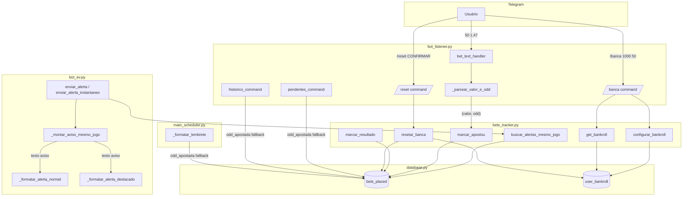
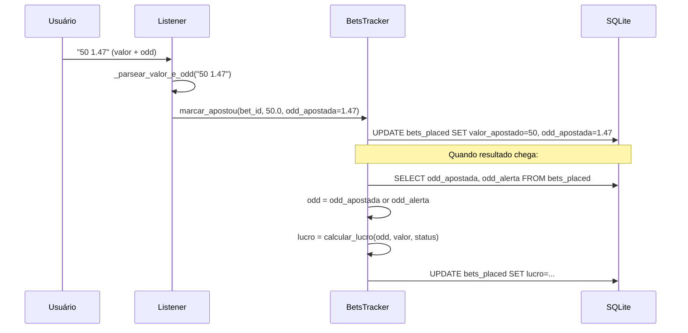
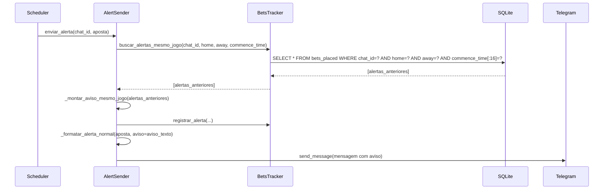

# Design — v1.2: Aviso de Jogo Duplicado, Odd Apostada e Gestão de Banca

## Visão Geral

Esta versão implementa três melhorias interligadas no Bot EV+:

1. **Aviso de jogo duplicado** — ao enviar um alerta, o sistema consulta alertas anteriores para o mesmo jogo (mesmo `home`, `away`, `commence_time[:16]`) e injeta um aviso no corpo da mensagem.
2. **Odd apostada** — o usuário pode informar a odd real ao confirmar a aposta. O cálculo de lucro usa `odd_apostada` com fallback para `odd_alerta`.
3. **Gestão de banca** — comandos `/banca` (configurar/consultar) e `/reset` (apagar dados) com tabela `user_bankroll`.

As três funcionalidades compartilham o mesmo fluxo de dados: o `BetsTracker` é o ponto central de lógica de negócio, o `AlertSender` consome dados do tracker para montar avisos, e o `Listener` expõe os novos comandos e parsers ao usuário.

## Arquitetura



### Decisões de Design

| Decisão | Justificativa |
|---------|---------------|
| Migração idempotente via `ALTER TABLE ... ADD COLUMN` com try/except | Padrão já usado no projeto; evita dependência de framework de migração |
| `commence_time[:16]` para match de jogo | Ignora segundos e timezone suffix, agrupando alertas do mesmo evento |
| Fallback `odd_apostada → odd_alerta` no cálculo de lucro | Retrocompatibilidade com apostas registradas antes da v1.2 |
| `/banca` dual (config + consulta) | UX simplificada — um único comando para ambas ações |
| `/reset CONFIRMAR` como safety gate | Evita exclusão acidental de dados |
| `_montar_aviso_mesmo_jogo` como método separado | Testabilidade — função pura que recebe lista e retorna string |

## Componentes e Interfaces

### 1. Database (`src/core/database.py`)

**Alterações no `_init_db()`:**

```python
# Migração: coluna odd_apostada (já existente no código atual)
try:
    conn.execute("ALTER TABLE bets_placed ADD COLUMN odd_apostada REAL DEFAULT NULL")
except Exception:
    pass

# Nova tabela: user_bankroll
conn.execute("""
    CREATE TABLE IF NOT EXISTS user_bankroll (
        chat_id   TEXT PRIMARY KEY,
        bankroll  REAL NOT NULL,
        valor_unidade REAL NOT NULL,
        timestamp TEXT
    )
""")
```

### 2. BetsTracker (`src/bot/bets_tracker.py`)

**Novos métodos:**

```python
def buscar_alertas_mesmo_jogo(self, chat_id: str, home: str, away: str, commence_time: str) -> list[dict]:
    """Retorna alertas anteriores para o mesmo jogo (match por chat_id + home + away + commence_time[:16])."""

def configurar_bankroll(self, chat_id: str, bankroll: float, valor_unidade: float) -> None:
    """INSERT OR REPLACE na tabela user_bankroll."""

def get_bankroll(self, chat_id: str) -> dict | None:
    """Retorna {bankroll, valor_unidade} ou None se não configurado."""

def resetar_banca(self, chat_id: str) -> None:
    """DELETE FROM bets_placed WHERE chat_id = ? + DELETE FROM user_bankroll WHERE chat_id = ?"""
```

**Alteração em `marcar_apostou()`:**
- Parâmetro `odd_apostada: float | None = None` (já existente)
- Se `odd_apostada is None`, copia `odd_alerta` do registro

**Alteração em `marcar_resultado()`:**
- Usa `odd_apostada` para cálculo, com fallback `odd_alerta` se NULL (já implementado)

### 3. AlertSender (`src/bot/bot_ev.py`)

**Novo método:**

```python
def _montar_aviso_mesmo_jogo(self, alertas_anteriores: list[dict]) -> str:
    """
    Constrói texto de aviso para alertas duplicados.
    Retorna string vazia se lista vazia.
    Formato:
      ⚠️ Jogo duplicado! Você já recebeu X alerta(s):
      • Mercado: {market_type} | Odd: {odd} | Status: {status}
    """
```

**Alterações em `enviar_alerta()` e `enviar_alerta_instantaneo()`:**
- Antes de `registrar_alerta()`, chamar `buscar_alertas_mesmo_jogo()`
- Passar resultado para `_montar_aviso_mesmo_jogo()`
- Passar aviso para `_formatar_alerta_destacado()` / `_formatar_alerta_normal()`

**Alterações em `_formatar_alerta_destacado()` e `_formatar_alerta_normal()`:**
- Novo parâmetro: `aviso: str = ""`
- Se `aviso` não vazio, injetar após a primeira linha do template

### 4. Listener (`src/bot/bot_listener.py`)

**Novo método:**

```python
def _parsear_valor_e_odd(texto: str) -> tuple[float, float | None] | None:
    """
    Parseia input do usuário: "VALOR" ou "VALOR ODD".
    Aceita vírgula como separador decimal.
    Retorna (valor, odd) onde odd pode ser None, ou None se input inválido.
    Regras:
      - Máximo 2 partes separadas por espaço
      - Valor deve ser > 0
      - Odd (se presente) deve ser >= 1.01
    """
```

**Alteração em `bet_text_handler()`:**
- Substituir `_validar_valor()` por `_parsear_valor_e_odd()`
- Passar `odd_apostada` para `marcar_apostou()`

**Novos handlers:**

```python
async def banca_command(update, context):
    """
    /banca 1000 50 → configurar_bankroll(chat_id, 1000, 50)
    /banca → exibir resumo (bankroll, valor_unidade, total apostado, lucro, ROI)
    """

async def reset_command(update, context):
    """
    /reset → aviso + instrução para /reset CONFIRMAR
    /reset CONFIRMAR → resetar_banca(chat_id) + confirmação
    """
```

**Alterações em `pendentes_command()` e `historico_command()`:**
- Exibir `odd_apostada` quando disponível, fallback `odd_alerta`

### 5. Scheduler (`src/scanner/main_scheduler.py`)

**Alteração em `_formatar_lembrete()`:**
- Exibir `odd_apostada` quando disponível, fallback `odd_alerta`

## Modelos de Dados

### Tabela `bets_placed` (alteração)

| Coluna | Tipo | Default | Descrição |
|--------|------|---------|-----------|
| odd_apostada | REAL | NULL | Odd real informada pelo usuário na confirmação |

### Tabela `user_bankroll` (nova)

| Coluna | Tipo | Constraint | Descrição |
|--------|------|------------|-----------|
| chat_id | TEXT | PRIMARY KEY | Identificador do usuário Telegram |
| bankroll | REAL | NOT NULL | Capital total disponível |
| valor_unidade | REAL | NOT NULL | Valor monetário de 1 unidade de stake |
| timestamp | TEXT | — | Data/hora da última atualização |

### Fluxo de Dados: Odd Apostada



### Fluxo de Dados: Aviso de Jogo Duplicado



## Propriedades de Correção

*Uma propriedade é uma característica ou comportamento que deve ser verdadeiro em todas as execuções válidas de um sistema — essencialmente, uma declaração formal sobre o que o sistema deve fazer. Propriedades servem como ponte entre especificações legíveis por humanos e garantias de correção verificáveis por máquina.*

### Property 1: Consulta de alertas do mesmo jogo retorna registros corretos

*Para qualquer* conjunto de alertas registrados e qualquer consulta `(chat_id, home, away, commence_time)`, `buscar_alertas_mesmo_jogo` deve retornar exatamente os registros onde `chat_id` coincide, `home` coincide, `away` coincide e os primeiros 16 caracteres de `commence_time` coincidem — e nenhum outro.

**Validates: Requirements 3.1, 3.2**

### Property 2: Persistência de odd_apostada com fallback

*Para qualquer* aposta registrada e qualquer valor de `odd_apostada` (float > 1.0 ou None), após `marcar_apostou(bet_id, valor, odd_apostada)`, o campo `odd_apostada` no banco deve conter: o valor informado se não-None, ou o valor de `odd_alerta` do registro se None.

**Validates: Requirements 4.1, 4.2**

### Property 3: Cálculo de lucro usa odd correta

*Para qualquer* aposta com `odd_apostada` definida ou NULL, e qualquer status final válido (`ganhou`, `perdeu`, `empate`, `cashout`), `marcar_resultado` deve calcular o lucro usando `odd_apostada` quando disponível, com fallback para `odd_alerta`. O lucro resultante deve ser igual a `calcular_lucro(odd_efetiva, valor_apostado, status, valor_cashout)`.

**Validates: Requirements 4.3**

### Property 4: Round-trip de configuração de bankroll

*Para qualquer* `chat_id`, `bankroll` (float > 0) e `valor_unidade` (float > 0), após `configurar_bankroll(chat_id, bankroll, valor_unidade)`, `get_bankroll(chat_id)` deve retornar um dicionário com os mesmos valores de `bankroll` e `valor_unidade`.

**Validates: Requirements 5.1, 5.2**

### Property 5: Reset apaga todos os dados do usuário

*Para qualquer* `chat_id` com N apostas registradas e bankroll configurado, após `resetar_banca(chat_id)`, `get_pendentes(chat_id)` deve retornar lista vazia, `get_historico(chat_id)` deve retornar lista vazia, e `get_bankroll(chat_id)` deve retornar None.

**Validates: Requirements 6.1, 6.2**

### Property 6: Construção de aviso de jogo duplicado

*Para qualquer* lista não-vazia de alertas anteriores (cada um com `market_type`, `odd_alerta`, `status`), `_montar_aviso_mesmo_jogo(alertas)` deve retornar uma string que contém informações de cada alerta da lista. Para lista vazia, deve retornar string vazia.

**Validates: Requirements 7.1, 7.2**

### Property 7: Injeção de aviso no template

*Para qualquer* string de aviso não-vazia e qualquer dados de aposta válidos, os métodos `_formatar_alerta_destacado(aposta, aviso=aviso)` e `_formatar_alerta_normal(aposta, aviso=aviso)` devem produzir uma mensagem que contém o texto do aviso. Para aviso vazio ou None, a mensagem não deve conter texto de aviso adicional.

**Validates: Requirements 8.2, 8.3**

### Property 8: Parsing de valor e odd

*Para qualquer* valor numérico positivo `v` e odd opcional `o` (>= 1.01), a função `_parsear_valor_e_odd` deve:
- Para input `str(v)`: retornar `(v, None)`
- Para input `f"{v} {o}"`: retornar `(v, o)`
- Para input com vírgula como separador decimal: retornar os mesmos valores normalizados

E para qualquer input inválido (texto não-numérico, odd < 1.01, mais de 2 partes), deve retornar `None`.

**Validates: Requirements 9.1, 9.2, 9.3**

### Property 9: Exibição de odd com fallback

*Para qualquer* aposta com `odd_apostada` definida ou NULL, as funções de formatação (pendentes, histórico, lembrete) devem exibir `odd_apostada` quando disponível (não-None), e `odd_alerta` caso contrário.

**Validates: Requirements 10.1, 10.2, 10.3**

## Tratamento de Erros

| Cenário | Comportamento |
|---------|---------------|
| Migração `ALTER TABLE` falha (coluna já existe) | `try/except` silencioso — idempotente |
| `buscar_alertas_mesmo_jogo` falha (erro DB) | Log do erro, retorna lista vazia, alerta é enviado sem aviso |
| `_parsear_valor_e_odd` recebe input inválido | Retorna `None`, handler envia mensagem de erro ao usuário |
| `/banca` com argumentos inválidos (não-numéricos) | Mensagem de erro com formato correto esperado |
| `/reset` sem `CONFIRMAR` | Mensagem de aviso, dados não são alterados |
| `configurar_bankroll` com valores ≤ 0 | Validação no Listener antes de chamar o método |
| `odd_apostada` NULL em registro antigo | Fallback transparente para `odd_alerta` em todos os pontos de uso |

## Estratégia de Testes

### Testes Unitários (pytest)

- **Database**: Verificar criação idempotente de tabela e coluna
- **BetsTracker**: Testar cada novo método isoladamente com banco temporário
- **AlertSender**: Testar `_montar_aviso_mesmo_jogo` com mocks
- **Listener**: Testar `_parsear_valor_e_odd` como função pura
- **Comandos**: Testar `/banca` e `/reset` com mocks do Telegram

### Testes Property-Based (Hypothesis)

O projeto já usa Hypothesis (evidenciado pelo diretório `.hypothesis/`). Cada propriedade de correção será implementada como um teste property-based com mínimo de 100 iterações.

**Biblioteca**: `hypothesis` (Python)
**Configuração**: `@settings(max_examples=100)`

**Propriedades a implementar:**

| # | Propriedade | Módulo Testado |
|---|-------------|----------------|
| 1 | Consulta mesmo jogo | `bets_tracker.py` |
| 2 | Persistência odd_apostada | `bets_tracker.py` |
| 3 | Cálculo lucro com odd correta | `bets_tracker.py` |
| 4 | Round-trip bankroll | `bets_tracker.py` |
| 5 | Reset apaga dados | `bets_tracker.py` |
| 6 | Construção aviso duplicado | `bot_ev.py` |
| 7 | Injeção aviso template | `bot_ev.py` |
| 8 | Parsing valor/odd | `bot_listener.py` |
| 9 | Exibição odd fallback | `bot_listener.py` / `main_scheduler.py` |

**Tag format**: `Feature: bet-tracking-v12, Property {number}: {title}`

### Testes de Integração

- Fluxo completo: alerta → buscar duplicados → montar aviso → enviar com aviso
- Fluxo completo: confirmação de aposta com odd → resultado → lucro correto
- Fluxo completo: `/banca 1000 50` → `/banca` (consulta) → exibe valores corretos
- Fluxo completo: `/reset CONFIRMAR` → dados apagados
