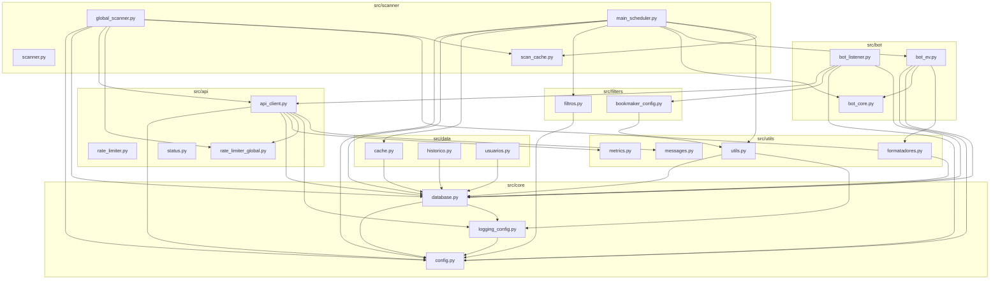

# Design Document: Project Restructure

## Overview

This design describes the technical approach for reorganizing the Bot EV+ project from a flat structure (all Python files in the root directory) into a modular `src/` package structure. The restructuring preserves all runtime behavior, Docker compatibility, and entrypoint accessibility while improving code organization and maintainability.

The project currently has ~20 Python modules in the root directory with cross-cutting imports. The target structure groups these into domain-specific packages under a `src/` top-level package, with thin entrypoint wrappers remaining at the project root.

## Architecture

### Target Directory Structure

```
project_root/
├── src/
│   ├── __init__.py
│   ├── core/
│   │   ├── __init__.py
│   │   ├── config.py
│   │   ├── logging_config.py
│   │   └── database.py
│   ├── api/
│   │   ├── __init__.py
│   │   ├── api_client.py
│   │   ├── rate_limiter.py
│   │   ├── rate_limiter_global.py
│   │   └── status.py
│   ├── bot/
│   │   ├── __init__.py
│   │   ├── bot_listener.py
│   │   ├── bot_ev.py
│   │   └── bot_core.py
│   ├── scanner/
│   │   ├── __init__.py
│   │   ├── global_scanner.py
│   │   ├── main_scheduler.py
│   │   ├── scanner.py
│   │   └── scan_cache.py
│   ├── filters/
│   │   ├── __init__.py
│   │   ├── filtros.py
│   │   └── bookmaker_config.py
│   ├── data/
│   │   ├── __init__.py
│   │   ├── cache.py
│   │   ├── historico.py
│   │   └── usuarios.py
│   └── utils/
│       ├── __init__.py
│       ├── formatadores.py
│       ├── messages.py
│       ├── metrics.py
│       └── utils.py
├── main_scheduler.py          # thin entrypoint wrapper
├── global_scanner.py          # thin entrypoint wrapper
├── bot_listener.py            # thin entrypoint wrapper
├── init_database.py           # thin entrypoint wrapper
├── web_dashboard.py           # thin entrypoint wrapper (if exists)
├── Dockerfile
├── docker-compose.yml
├── docker-entrypoint.sh
├── requirements.txt
├── .env
├── data/                      # runtime data (unchanged)
└── logs/                      # runtime logs (unchanged)
```

### Dependency Graph (Simplified)



## Components and Interfaces

### 1. Thin Entrypoint Wrappers (Project Root)

Each entrypoint script at the project root becomes a minimal wrapper that imports and delegates to the actual implementation inside `src/`.

**Pattern:**
```python
#!/usr/bin/env python3
"""Entrypoint wrapper - delegates to src.scanner.global_scanner"""
import sys
import os

# Ensure project root is in sys.path for src package resolution
sys.path.insert(0, os.path.dirname(os.path.abspath(__file__)))

from src.scanner.global_scanner import main

if __name__ == "__main__":
    import asyncio
    asyncio.run(main())
```

**Entrypoints to preserve:**
| Root Script | Delegates To |
|---|---|
| `global_scanner.py` | `src.scanner.global_scanner.main` |
| `main_scheduler.py` | `src.scanner.main_scheduler.main` |
| `bot_listener.py` | `src.bot.bot_listener` (app run) |
| `init_database.py` | `src.core.database` (init) |
| `web_dashboard.py` | `src.utils.web_dashboard` (if exists) |

### 2. Package `__init__.py` Re-exports

Each package's `__init__.py` re-exports the primary public API to allow shorter import paths where convenient.

**`src/core/__init__.py`:**
```python
from src.core.config import FEED_ID, BASE_PATH, feed_path, get_telegram_token, get_database_path
from src.core.database import get_db, Database, generate_alert_hash
from src.core.logging_config import get_logger, get_general_logger, get_scan_logger
```

**`src/filters/__init__.py`:**
```python
from src.filters.filtros import evento_valido, aplicar_filtros_dinamicos, validar_filtros_usuario
from src.filters.bookmaker_config import usuario_configurado
```

**`src/data/__init__.py`:**
```python
from src.data.cache import get_cache, AlertCache
from src.data.historico import get_history, AlertHistory
from src.data.usuarios import get_user_manager
```

**`src/utils/__init__.py`:**
```python
from src.utils.formatadores import formatar_ev, formatar_odd, formatar_stake
from src.utils.utils import logger_geral, logger_scan
```

### 3. Import Update Strategy

All internal imports will be updated to use absolute paths from the `src` package root. The strategy:

1. **Absolute imports from `src`**: All inter-module imports use the full path (e.g., `from src.core.config import FEED_ID`)
2. **No relative imports**: Avoids confusion and makes dependencies explicit
3. **Preserve aliases**: Where modules define aliases (e.g., `OddsAPIClient = OddsAPI`), these remain in place

**Example transformations:**
| Before | After |
|---|---|
| `from config import FEED_ID` | `from src.core.config import FEED_ID` |
| `from database import get_db` | `from src.core.database import get_db` |
| `from filtros import evento_valido` | `from src.filters.filtros import evento_valido` |
| `from api_client import OddsAPI` | `from src.api.api_client import OddsAPI` |
| `from utils import logger_geral` | `from src.utils.utils import logger_geral` |
| `from formatadores import formatar_ev` | `from src.utils.formatadores import formatar_ev` |
| `from cache import get_cache` | `from src.data.cache import get_cache` |
| `from historico import get_history` | `from src.data.historico import get_history` |
| `from bot_core import definir_stake` | `from src.bot.bot_core import definir_stake` |
| `from bot_ev import enviar_alertas_batch` | `from src.bot.bot_ev import enviar_alertas_batch` |
| `from scan_cache import get_snapshot_cache` | `from src.scanner.scan_cache import get_snapshot_cache` |
| `from rate_limiter import get_rate_limiter` | `from src.api.rate_limiter import get_rate_limiter` |
| `from rate_limiter_global import get_global_rate_limiter` | `from src.api.rate_limiter_global import get_global_rate_limiter` |
| `from status import get_status` | `from src.api.status import get_status` |
| `from usuarios import get_user_manager` | `from src.data.usuarios import get_user_manager` |
| `from messages import no_events` | `from src.utils.messages import no_events` |
| `from metrics import record_alert_processing` | `from src.utils.metrics import record_alert_processing` |
| `from scanner import scan_apostas` | `from src.scanner.scanner import scan_apostas` |
| `from bookmaker_config import usuario_configurado` | `from src.filters.bookmaker_config import usuario_configurado` |
| `from logging_config import get_logger` | `from src.core.logging_config import get_logger` |
| `from global_scanner import GlobalScanner` | `from src.scanner.global_scanner import GlobalScanner` |
| `from main_scheduler import BotScheduler` | `from src.scanner.main_scheduler import BotScheduler` |

### 4. BASE_PATH Resolution Fix

The current `config.py` uses:
```python
BASE_PATH = os.path.dirname(os.path.abspath(__file__))
```

After moving to `src/core/config.py`, this would resolve to `project_root/src/core/`. We need it to resolve to `project_root/`.

**Solution:**
```python
# Navigate up from src/core/ to project root
BASE_PATH = os.path.dirname(os.path.dirname(os.path.dirname(os.path.abspath(__file__))))
```

This traverses: `__file__` → `src/core/` → `src/` → `project_root/`

### 5. Docker Configuration Updates

**Dockerfile changes:**
```dockerfile
# Copy source code (updated for new structure)
COPY src/ ./src/
COPY *.py ./
COPY requirements.txt .
COPY docker-entrypoint.sh /usr/local/bin/
```

The key insight: since entrypoint wrappers remain at the root and `WORKDIR` is `/app`, all existing Docker commands (`python global_scanner.py`, `python main_scheduler.py`, `python bot_listener.py`) continue to work unchanged.

**docker-entrypoint.sh changes:**
The entrypoint script references like `python global_scanner.py` continue to work because the thin wrappers remain at the project root. The inline Python snippets that import modules need updating:

```bash
# Before
python -c "from database import get_db; ..."
# After
python -c "from src.core.database import get_db; ..."
```

**docker-compose.yml:** No changes needed. Volume mounts for `data/` and `logs/` remain at the same relative paths.

## Data Models

No data model changes. The restructuring is purely organizational — all database schemas, file formats, and runtime data structures remain identical. The `data/` and `logs/` directories stay at the project root and are accessed via `BASE_PATH` which continues to resolve to the project root.

## Error Handling

### Circular Import Prevention

The current codebase has some local imports (e.g., `from bot_ev import enviar_alerta_instantaneo` inside a function in `main_scheduler.py`). These lazy imports exist to break circular dependencies and must be preserved during restructuring.

**Strategy:**
1. Identify all local/lazy imports in the codebase
2. Update their paths but keep them as local imports
3. If new circular dependencies emerge from the package structure, resolve by:
   - Moving the import inside the function that uses it (lazy import)
   - Extracting shared interfaces into a separate module

### Import Resolution Errors

If an import cannot be resolved after restructuring:
1. The verification script will catch it as an `ImportError`
2. The error message will identify the file and the unresolved import
3. Resolution: check the module mapping table and fix the path

### Path Resolution Errors

If `BASE_PATH` or `os.getcwd()` resolves incorrectly:
1. The verification script will check that `data/` and `logs/` paths exist
2. `config.py` includes a runtime assertion: `assert os.path.isdir(os.path.join(BASE_PATH, "data"))`

## Testing Strategy

### Why Property-Based Testing Does Not Apply

This feature is a **one-time code migration** (moving files and updating imports). It does not introduce new business logic, algorithms, or data transformations with a meaningful input space. The "inputs" are the fixed set of project files, and correctness is binary (imports resolve or they don't). PBT requires universal properties over a large input space, which doesn't exist here.

### Verification Approach

**1. Import Verification (Smoke Tests)**

A verification script that attempts to import every module in the restructured project:

```python
#!/usr/bin/env python3
"""Verify all modules can be imported after restructuring."""
import importlib
import sys

modules_to_verify = [
    "src.core.config",
    "src.core.logging_config",
    "src.core.database",
    "src.api.api_client",
    "src.api.rate_limiter",
    "src.api.rate_limiter_global",
    "src.api.status",
    "src.bot.bot_core",
    "src.bot.bot_ev",
    "src.bot.bot_listener",
    "src.scanner.global_scanner",
    "src.scanner.main_scheduler",
    "src.scanner.scanner",
    "src.scanner.scan_cache",
    "src.filters.filtros",
    "src.filters.bookmaker_config",
    "src.data.cache",
    "src.data.historico",
    "src.data.usuarios",
    "src.utils.formatadores",
    "src.utils.messages",
    "src.utils.metrics",
    "src.utils.utils",
]

errors = []
for module in modules_to_verify:
    try:
        importlib.import_module(module)
    except ImportError as e:
        errors.append(f"{module}: {e}")

if errors:
    print("FAILED - Import errors:")
    for err in errors:
        print(f"  ✗ {err}")
    sys.exit(1)
else:
    print(f"✓ All {len(modules_to_verify)} modules imported successfully")
```

**2. Entrypoint Verification (Smoke Tests)**

Verify each root-level entrypoint can be loaded:

```python
import subprocess
import sys

entrypoints = [
    "global_scanner.py",
    "main_scheduler.py",
    "bot_listener.py",
    "init_database.py",
]

for ep in entrypoints:
    result = subprocess.run(
        [sys.executable, "-c", f"import importlib.util; spec = importlib.util.spec_from_file_location('ep', '{ep}'); mod = importlib.util.module_from_spec(spec)"],
        capture_output=True, text=True
    )
    # Check syntax is valid (not full execution)
```

**3. Path Resolution Verification (Example Tests)**

```python
from src.core.config import BASE_PATH, feed_path
import os

# BASE_PATH should be the project root
assert os.path.isfile(os.path.join(BASE_PATH, "Dockerfile")), "BASE_PATH doesn't point to project root"
assert os.path.isdir(os.path.join(BASE_PATH, "data")), "data/ not found from BASE_PATH"
assert os.path.isdir(os.path.join(BASE_PATH, "logs")), "logs/ not found from BASE_PATH"
assert os.path.isdir(os.path.join(BASE_PATH, "src")), "src/ not found from BASE_PATH"

# feed_path should resolve to data/{feed_id}/filename
path = feed_path("bot.db", "default")
assert path.endswith(os.path.join("data", "default", "bot.db"))
```

**4. Docker Build Verification**

```bash
docker build -t bot-ev-test .
docker run --rm bot-ev-test test
```

This runs the existing `test` mode in `docker-entrypoint.sh` which imports key modules.

### Test Execution Order

1. Run import verification script (catches broken imports immediately)
2. Run path resolution tests (catches BASE_PATH miscalculation)
3. Run entrypoint verification (catches wrapper issues)
4. Build Docker image (catches Dockerfile/COPY issues)
5. Run Docker test mode (end-to-end verification in container)
