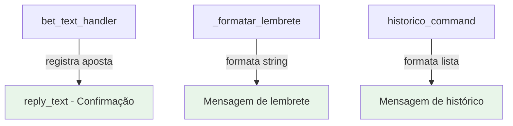

# Design Document — Visual Improvements

## Visão Geral

Este design aborda três melhorias visuais nas mensagens do bot Telegram de apostas esportivas:

1. **Mensagem de confirmação** — incluir a odd apostada no texto de confirmação
2. **Bloco comparativo de EV** — exibir comparação entre odd do alerta e odd apostada no lembrete pós-jogo, com cálculo de EV real
3. **Separadores no histórico** — adicionar linhas separadoras entre apostas no comando `/historico`

Todas as alterações são restritas ao arquivo `src/bot/bot_listener.py` e envolvem apenas formatação de strings. Não há mudanças em banco de dados, API ou módulos novos.

## Arquitetura

A arquitetura existente permanece inalterada. As três modificações são pontuais:



As caixas verdes representam os pontos de modificação. Nenhum componente novo é introduzido.

## Componentes e Interfaces

### 1. Mensagem de Confirmação (linha ~3240)

**Localização:** `bet_text_handler()` em `src/bot/bot_listener.py`

**Mudança:** Substituir a linha:
```python
await update.message.reply_text(f"✅ Aposta de R$ {valor:.2f} registrada!", parse_mode='HTML')
```

Por lógica condicional:
```python
if odd_apostada:
    texto_confirmacao = f"✅ Aposta registrada — R$ {valor:.2f} @ {odd_apostada:.2f}"
else:
    texto_confirmacao = f"✅ Aposta registrada — R$ {valor:.2f}"
await update.message.reply_text(texto_confirmacao, parse_mode='HTML')
```

### 2. Bloco Comparativo de EV (função `_formatar_lembrete`)

**Localização:** `_formatar_lembrete()` em `src/bot/bot_listener.py` (linha ~3399)

**Mudança:** Antes da linha `"Qual foi o resultado?"`, inserir bloco condicional:

```python
ev_alerta = aposta.get('ev_alerta', 0) or 0
odd_alerta_val = aposta.get('odd_alerta', 0) or 0
odd_apostada_val = aposta.get('odd_apostada')

bloco_ev = ""
if (odd_apostada_val is not None 
    and odd_apostada_val != odd_alerta_val 
    and odd_alerta_val > 0 
    and (1 + ev_alerta) > 0):
    prob_implicita = 1 / (odd_alerta_val / (1 + ev_alerta))
    ev_real = (odd_apostada_val * prob_implicita) - 1
    bloco_ev = (
        f"\n📊 Odd alerta: {odd_alerta_val:.2f} → Odd apostada: {odd_apostada_val:.2f}\n"
        f"📈 EV original: {ev_alerta*100:.1f}% → EV real: {ev_real*100:.1f}%\n"
    )
```

O `bloco_ev` é inserido entre os dados da aposta e a pergunta final.

### 3. Separadores no Histórico (função `historico_command`)

**Localização:** `historico_command()` em `src/bot/bot_listener.py` (linha ~3456)

**Mudança:** No loop de formatação, adicionar separador após cada aposta:

```python
separador = "─────────────────"
for ap in historico:
    emoji = status_emoji.get(ap.get('status', ''), '❓')
    odd_exibir = ap.get('odd_apostada') or ap.get('odd_alerta', 0)
    mercado = ap.get('market_name_fmt') or ap.get('market_type', '')
    msg += (
        f"{emoji} {ap.get('home', '')} vs {ap.get('away', '')}\n"
        f"   📌 {mercado} | Odd: {odd_exibir:.2f} | R$ {ap.get('valor_apostado', 0):.2f}"
        f" | Lucro: R$ {ap.get('lucro', 0):+.2f}\n"
        f"{separador}\n\n"
    )
```

## Modelos de Dados

Nenhuma alteração nos modelos de dados. Os campos já existem na tabela `bets_placed`:

| Campo | Tipo | Descrição |
|-------|------|-----------|
| `valor_apostado` | REAL | Valor apostado pelo usuário |
| `odd_apostada` | REAL | Odd efetivamente apostada |
| `odd_alerta` | REAL | Odd original do alerta |
| `ev_alerta` | REAL | EV calculado no momento do alerta |

Todos os campos são lidos via `aposta.get(...)` nos dicts retornados por `get_pendentes()` e `get_historico()`.

## Propriedades de Corretude

*Uma propriedade é uma característica ou comportamento que deve ser verdadeiro em todas as execuções válidas de um sistema — essencialmente, uma declaração formal sobre o que o sistema deve fazer. Propriedades servem como ponte entre especificações legíveis por humanos e garantias de corretude verificáveis por máquina.*

### Propriedade 1: Formato da mensagem de confirmação

*Para qualquer* valor positivo e qualquer odd_apostada (positiva ou None), a mensagem de confirmação SHALL conter `"R$ {valor:.2f}"` e SHALL conter `"@ {odd_apostada:.2f}"` se e somente se odd_apostada não for None.

**Validates: Requirements 1.1, 1.2**

### Propriedade 2: Bloco EV presente e correto quando odds diferem

*Para qualquer* aposta onde odd_apostada ≠ odd_alerta, odd_alerta > 0 e (1 + ev_alerta) > 0, a saída de `_formatar_lembrete()` SHALL conter as linhas do bloco EV com os valores formatados corretamente, posicionadas antes de "Qual foi o resultado?".

**Validates: Requirements 2.1, 2.3**

### Propriedade 3: Bloco EV omitido quando condições não satisfeitas

*Para qualquer* aposta onde odd_apostada == odd_alerta OU odd_apostada é None OU odd_alerta == 0 OU (1 + ev_alerta) ≤ 0, a saída de `_formatar_lembrete()` SHALL NOT conter "📊" nem "📈".

**Validates: Requirements 2.4, 2.5**

### Propriedade 4: Corretude do cálculo de EV

*Para qualquer* odd_alerta > 0, ev_alerta > -1 e odd_apostada > 0, o ev_real calculado SHALL ser igual a `(odd_apostada * (1 + ev_alerta) / odd_alerta) - 1` com precisão de ponto flutuante.

**Validates: Requirements 2.2**

### Propriedade 5: Estrutura do histórico com separadores

*Para qualquer* lista não-vazia de apostas finalizadas, a saída de `historico_command` SHALL conter o cabeçalho com título e período, seguido de cada aposta com seus dados e um separador `"─────────────────"` após cada entrada.

**Validates: Requirements 3.1, 3.2**

## Tratamento de Erros

| Cenário | Tratamento |
|---------|------------|
| `odd_apostada` é None | Omitir odd da confirmação; omitir bloco EV no lembrete |
| `odd_alerta` é 0 | Omitir bloco EV (evita divisão por zero) |
| `(1 + ev_alerta)` ≤ 0 | Omitir bloco EV (evita divisão por zero ou resultado inválido) |
| `ev_alerta` é None | Tratar como 0 via `or 0` |
| Lista de histórico vazia | Mensagem "Nenhuma aposta finalizada" (comportamento existente, inalterado) |

## Estratégia de Testes

### Abordagem Dual

- **Testes unitários**: Verificar exemplos específicos e edge cases
- **Testes de propriedade**: Verificar propriedades universais com inputs gerados

### Testes de Propriedade (Property-Based Testing)

**Biblioteca:** `hypothesis` (já presente no projeto — diretório `.hypothesis/` existe)

**Configuração:**
- Mínimo 100 iterações por teste de propriedade
- Cada teste referencia a propriedade do design document
- Formato de tag: **Feature: visual-improvements, Property {número}: {texto}**

**Testes a implementar:**

1. **Propriedade 1** — Gerar `valor` (float positivo) e `odd_apostada` (float positivo ou None). Verificar formato da string de confirmação.
2. **Propriedade 2** — Gerar aposta com odds diferentes e ev válido. Verificar presença e conteúdo do bloco EV.
3. **Propriedade 3** — Gerar aposta com odds iguais, ou odd_apostada=None, ou odd_alerta=0, ou ev_alerta≤-1. Verificar ausência do bloco EV.
4. **Propriedade 4** — Gerar valores numéricos válidos. Verificar que o cálculo matemático está correto.
5. **Propriedade 5** — Gerar lista de 1-20 apostas com dados aleatórios. Verificar presença de separadores e cabeçalho.

### Testes Unitários (Exemplos)

- Confirmação com odd: `valor=50.0, odd=2.15` → `"✅ Aposta registrada — R$ 50.00 @ 2.15"`
- Confirmação sem odd: `valor=100.0, odd=None` → `"✅ Aposta registrada — R$ 100.00"`
- Bloco EV com valores conhecidos: `odd_alerta=2.0, ev_alerta=0.10, odd_apostada=1.80` → verificar cálculo exato
- Histórico com 3 apostas → verificar 3 separadores presentes
- `parse_mode='HTML'` em todas as chamadas de reply_text
